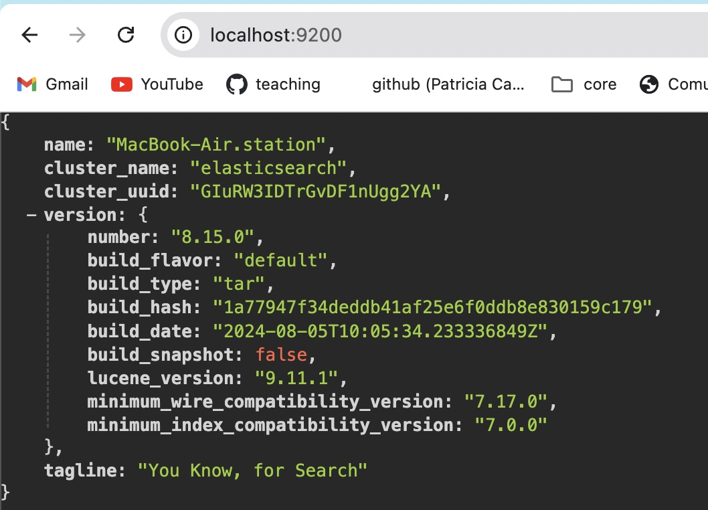

# 1-Intro

1. [Módulo 1: Introducción a Elasticsearch](#schema1)
2. [Instalar Elasticsearch](#schema2)
3. [Ejercicio 1: Configuración de Elasticsearch](#schema3)
4. [Ejercicio 2: Creación de un índice y carga de documentos](#schema4)
5. [Ver el Índice y Documentos en localhost](#schema5)


<hr>

<a name="schema1"></a>

## 1- Módulo 1: Introducción a Elasticsearch
### Qué es Elasticsearch
- Elasticsearch es un motor de búsqueda y análisis de datos en tiempo real, capaz de indexar y realizar búsquedas en grandes volúmenes de datos distribuidos.
### Conceptos clave:
- Cluster: Un conjunto de nodos (servidores) que trabajan juntos.
- Node: Cada instancia de Elasticsearch que forma parte de un cluster.
- Index: Similar a una base de datos en RDBMS, contiene documentos.
- Document: La unidad básica de información en Elasticsearch, almacenado en JSON.
- Shard: Fragmento de un índice, permite escalar el índice a través de múltiples nodos.
- Replica: Copia de un shard, proporciona alta disponibilidad y rendimiento.


<hr>

<a name="schema2"></a>

## 2. Instalar Elasticsearch

- Descargar Elasticsearch
    - Descarga la versión de Elasticsearch compatible con macOS desde la página oficial de descargas:
        - Ve a la página de descargas de Elasticsearch.
        - Descarga el archivo .tar.gz o .zip.
- Extraer y configurar Elasticsearch
    - Abre Terminal y navega al directorio donde descargaste el archivo.
 
        ```bash
        cd ~/Downloads
        ```
    - Extrae el contenido del archivo descargado:

        ```bash
        tar -xzf elasticsearch-<version>.tar.gz
        ```
        O si descargaste el archivo .zip:

        ```bash
        unzip elasticsearch-<version>.zip
        ```
    - Esto creará un directorio llamado elasticsearch-<version>.

    - Mueve el directorio de Elasticsearch a una ubicación de tu elección (por ejemplo, /usr/local/):

        ```bash
        sudo mv elasticsearch-<version> /usr/local/elasticsearch
        ```
### Iniciar Elasticsearch
    
- Navega al directorio bin dentro del directorio de Elasticsearch:
    ```bash
    cd /usr/local/elasticsearch/bin
    ```
- Inicia Elasticsearch con el siguiente comando:

    ```bash
    ./elasticsearch
    ````

- Este comando iniciará Elasticsearch en segundo plano y lo pondrá disponible en http://localhost:9200/.
- Si deseas que Elasticsearch se ejecute en segundo plano (sin ocupar la terminal), puedes utilizar nohup:

    ```bash
    nohup ./elasticsearch &
    ```
### Verificar la instalación
- Una vez que Elasticsearch esté en funcionamiento, puedes verificar que todo esté correcto accediendo desde tu navegador a:

    ```bash
    http://localhost:9200/
    ````

- Deberías ver una respuesta en formato JSON con información sobre el clúster de Elasticsearch.

- Alternativamente, puedes usar curl desde la terminal para verificar:

    ```bash
    curl -X GET "localhost:9200/"
    ```
### Configurar Elasticsearch (opcional)
- Si deseas personalizar la configuración de Elasticsearch, puedes editar el archivo de configuración elasticsearch.yml ubicado en /usr/local/elasticsearch/config/. Aquí puedes ajustar parámetros como el nombre del clúster, configuraciones de red, seguridad, entre otros.

### Parar Elasticsearch
- Para detener Elasticsearch, puedes simplemente presionar Ctrl + C en la terminal donde se está ejecutando, o matar el proceso si se está ejecutando en segundo plano:

    ```bash
    ps aux | grep elasticsearch
    kill <PID>
    ```
- Donde <PID> es el ID del proceso de Elasticsearch.


<hr>

<a name="schema3"></a>

### 3. Ejercicio 1: Configuración de Elasticsearch

### Configuración básica:
- Inicia Elasticsearch y verifica que esté corriendo accediendo a http://localhost:9200/ desde tu navegador.
    - Navega al directorio bin dentro del directorio de Elasticsearch:
    ```bash
    cd /usr/local/elasticsearch
    ```
     -  Crear contraseña
    ```
    export ELASTIC_PASSWORD="your_password"
    ```
    - Inicia Elasticsearch con el siguiente comando:

    ```bash
    ./bin/elasticsearch
    ```
 
- Revisa el archivo de configuración `elasticsearch.yml` para entender los parámetros básicos, como el nombre del cluster y las configuraciones de red.
- Cambios añadidos a `elasticsearch.yml`
   ```yml
    # Network
        network.host: 0.0.0.0
        http.port: 9200

    # Security
        xpack.security.enabled: false
    ```


<hr>

<a name="schema4"></a>

## 4. Ejercicio 2: Creación de un índice y carga de documentos
1. Crear un índice: Usa la API REST de Elasticsearch para crear un índice llamado library. En este caso, utilizaremos curl desde la línea de comandos. Asegúrate de que el servidor Elasticsearch esté corriendo en localhost:9200 o ajusta la URL según sea necesario.
    ```bash
    curl -X PUT "localhost:9200/library" -H 'Content-Type: application/json'
    ```
2. Agregar documentos: Inserta un documento de ejemplo en el índice library.
    ```bash
    curl -X POST "localhost:9200/library/_doc/1" -H 'Content-Type: application/json' -d'
    {
    "title": "Elasticsearch Basics",
    "author": "John Doe",
    "published_year": 2023
    }
    '
    ```

3. Consulta el documento: Realiza una búsqueda básica en el índice library.
    ```bash
    curl -X GET "localhost:9200/library/_search" -H 'Content-Type: application/json' -d'
    {
    "query": {
        "match": {
        "title": "Elasticsearch"
        }
    }
    }
    '
    ```

<hr>

<a name="schema5"></a>

## 5. Ver el Índice y Documentos en localhost
1. Verificar que el Índice Exista
    - Primero, asegúrate de que el índice library se haya creado correctamente. Puedes hacerlo con el siguiente comando curl:

        ```bash
        curl -X GET "localhost:9200/_cat/indices?v"
        ```
    - Este comando te mostrará una lista de todos los índices disponibles. Busca library en la lista.

2. Consultar Documentos en el Índice

    - Puedes realizar una búsqueda en el índice library para ver los documentos que contiene. Usa el siguiente comando:

        ```bash
        curl -X GET "localhost:9200/library/_search?pretty"
        ```
        - El parámetro pretty hace que la salida sea más legible, con una estructura de datos formateada en JSON.

3. Ver un Documento Específico

    - Si conoces el ID del documento (en tu caso, 1), puedes recuperarlo directamente con el siguiente comando:

        ```bash
        curl -X GET "localhost:9200/library/_doc/1?pretty"
        ```
    - Esto debería devolverte el documento con ID 1 que has insertado previamente.


## 6. Introducción a FSCrawler

### Qué es FSCrawler
- FSCrawler es una herramienta para indexar archivos del sistema de archivos en Elasticsearch. Puede manejar diferentes tipos de archivos y extraer tanto contenido como metadatos para su indexación.
- Conceptos clave:
    - Job: Una tarea configurada en FSCrawler para escanear un directorio específico y enviar los datos a Elasticsearch.
    - Mapping: La estructura de los documentos indexados, especificada en Elasticsearch.

### Ejercicio 3: Instalación y configuración de FSCrawler
1. Instalación: Descarga e instala FSCrawler.
[Instrucciones de instalación](https://fscrawler.readthedocs.io/en/latest/installation.html)

    1. **Instalar Java**
        - Para más información sobre la instalación de java ir [Primeros pasos con Mac](https://github.com/patri-carrasco/primeros-pasos-mac)

    2. **Descargar FSCrawler**
         - Para más información sobre la instalación de Fscrawler [Primeros pasos con Mac](https://github.com/patri-carrasco/primeros-pasos-mac)
      

2. Configuración básica:
    - Crea un job básico que escanee un directorio local (/path/to/your/files).
        ```bash
        /.fscrawler job_name --url "http://localhost:9200"
        ```
    - Configura el archivo `job_name/_settings.json` para definir los parámetros del job (como el directorio a escanear, tipos de archivos permitidos, etc.).


Nota: Tras varios intentos de configurar fscrawler, dejo este ejercicio.